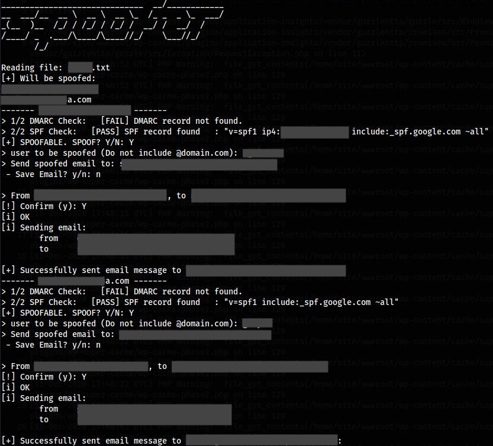

# DSpoofer

DSpoofer is a script to check if a domain is spoofable by validating its DMARC and SPF records. If the domain is spoofable, the script sends a proof-of-concept email to demonstrate email spoofing.

## Features

- Check a single domain or list of domains for spoofing vulnerabilities.
- Validate DMARC and SPF records.
- Send proof-of-concept emails to demonstrate spoofing.
- Accepts domains as arguments or from a text file.

## Prerequisites

Ensure you have a valid relay SMTP server available. This script authenticates to an SMTP relay, via smtp endpoint (hostname:port), username and password. via python's `smtplib`.

## Usage

After any of the below options are executed, the script provides a prompt, where, if the domain is "spoofable", send an optional PoC email. 

1. **Check a Single Domain**

   ```bash
   python3 dspoof.py --domain example.com
   ```

2. **Check Domains from a File**

   ```bash
   python3 dspoof.py --file domains.txt
   ```



## Security Considerations

- Ensure SMTP credentials (username and password) are stored securely and not hardcoded into the script. Consider using a `.env` file to store sensitive information, or python's `dotenv`.
- Be aware of legal and ethical implications of spoofing emails, even for testing purposes.

## Contributing

Contributions and improvements are welcome. Please create an issue for any bugs you find or features you'd like to add.
